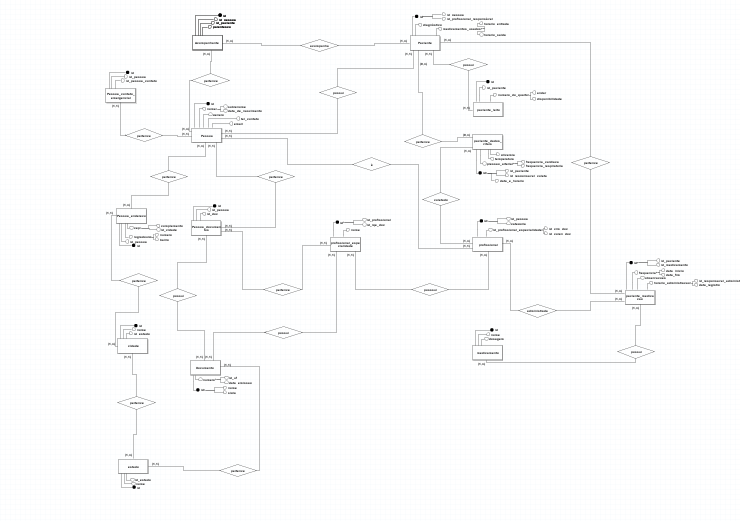

### 📋 Sistema de Triagem Hospitalar de Internação 🩺

#
Através da observabilidade de um problema cotidiano em hospitais, desenvolvemos um sistema que facilita o gerenciamento de dados coletados na triagem diária hospitalar de pacientes internados. Foi observado que era comum vários hospitais registrarem manualmente os dados da triagem de internação, com esta problemática, o sistema facilita e agiliza a coleta de dados importantes em uma internação hospitalar.
#

### Diagrama Conceitual

#

### Diagrama Entity-Relationship

#

### Links

Link Gráficos (Google Sheets): https://docs.google.com/spreadsheets/d/1phkhjtBnob6OkoQug4FdycQ3VlVDCnd4nOSqafbL580/edit?usp=sharing

Link Diagrama Entidade Relacionamento (DB Diagram): https://dbdiagram.io/d/Projeto-final-m3-665204fff84ecd1d2220e692

#
🖇️ Projeto desenvolvido como projeto final do módulo 3 para a PdA (Programadores do Amanhã)  

